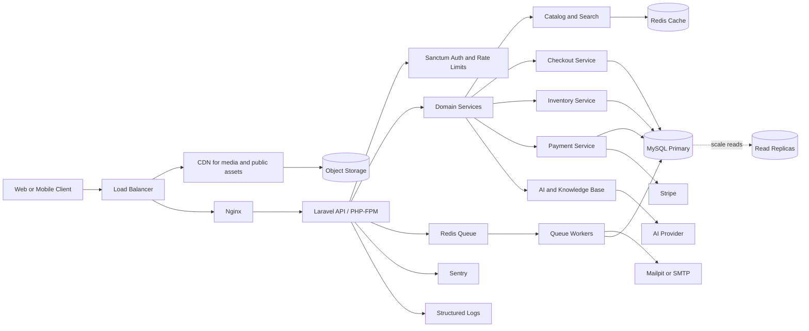

# Ecommerce API

[](../../actions/workflows/ci.yml)

Production-grade Laravel backend foundation for a scalable e-commerce platform.

## Stack

- Laravel 13 and PHP 8.4 runtime in Docker
- MySQL 8.4
- Redis for cache and queues
- Laravel Sanctum token authentication
- PHPUnit feature tests

## Project Overview

This repository is a presentation-ready Laravel e-commerce backend built to demonstrate production-grade backend engineering in a YouTube series. The codebase covers the full path from catalog browsing to checkout, payments, admin operations, analytics, AI-assisted search, observability, Dockerized local development, and CI/CD.

Series-friendly themes:

- Building a clean Laravel API with services, DTOs, resources, policies, and request validation.
- Designing safe checkout and inventory flows with transactions and row-level locking.
- Integrating Stripe webhooks with idempotency and no sensitive payment logging.
- Adding catalog caching, search, AI-assisted product discovery, and knowledge-base retrieval.
- Preparing for production with Docker, CI, rate limiting, monitoring, logs, and scaling documentation.

## Architecture



Core production boundaries:

- Controllers validate input, authorize access, and delegate work to services.
- Checkout, payment webhook handling, stock reservations, and order status transitions use service-level transactions.
- Stock changes go through centralized inventory and reservation services.
- Payment webhooks are idempotent by provider event ID.
- Catalog cache invalidation is handled by observers for products, variants, images, inventory, categories, and brands.

## Local Setup

```bash
cp .env.example .env
make composer
make up
docker compose exec app php artisan key:generate
make migrate
make seed
make test
```

The local Docker stack includes:

- `app`: PHP 8.4 FPM Laravel runtime with Composer and required extensions
- `nginx`: public HTTP entrypoint on `APP_PORT`, default `8000`
- `mysql`: MySQL 8.4 on `DB_FORWARD_PORT`, default `3306`
- `redis`: cache and queue backend on `REDIS_FORWARD_PORT`, default `6379`
- `rabbitmq`: local broker with management UI on `RABBITMQ_MANAGEMENT_FORWARD_PORT`, default `15672`
- `mailpit`: local SMTP capture with UI on `MAILPIT_FORWARD_PORT`, default `8025`

Useful make commands:

```bash
make up       # Build and start the local stack
make down     # Stop and remove local containers
make migrate  # Run database migrations
make seed     # Seed local data
make test     # Run the PHPUnit suite
make queue    # Run Supervisor-managed queue worker and scheduler
```

No production secrets are committed. The example values in `.env.example` are local placeholders; change passwords and API keys in your own `.env`.

## Testing

The suite is split by production concern so a focused area can be run without executing unrelated tests:

```bash
docker compose run --rm app php artisan test --testsuite=Authentication
docker compose run --rm app php artisan test --testsuite=ProductCatalog
docker compose run --rm app php artisan test --testsuite=Inventory
docker compose run --rm app php artisan test --testsuite=CartAndCheckout
docker compose run --rm app php artisan test --testsuite=PaymentWebhooks
docker compose run --rm app php artisan test --testsuite=Coupons
docker compose run --rm app php artisan test --testsuite=Orders
docker compose run --rm app php artisan test --testsuite=Search
docker compose run --rm app php artisan test --testsuite=AIFeatures
```

Tests use factories and `RefreshDatabase`; seeders are avoided except for application seed data during local setup. Stripe, AI, and queue/broker boundaries are faked in tests so the suite does not call real external APIs or message brokers.

Coverage can be generated when the container has Xdebug or PCOV enabled:

```bash
docker compose run --rm -e XDEBUG_MODE=coverage app php artisan test --coverage
docker compose run --rm -e XDEBUG_MODE=coverage app php artisan test --coverage-html storage/coverage
```

## API Documentation

- OpenAPI specification: [`docs/openapi.yaml`](docs/openapi.yaml)
- Endpoint reference: [`docs/api-endpoints.md`](docs/api-endpoints.md)
- Production scaling guide: [`docs/production-scaling.md`](docs/production-scaling.md)

API base URL:

```text
http://localhost:8000/api
```

Local service UIs:

```text
Mailpit:  http://localhost:8025
RabbitMQ: http://localhost:15672
```

## Seeded Accounts

All seeded users use the password `Password123`.

- `superadmin@example.com`
- `admin@example.com`
- `customer@example.com`

## API Endpoints

- `GET /api/health`
- `GET /api/products`
- `GET /api/products/{slug}`
- `GET /api/categories`
- `GET /api/brands`
- `POST /api/stripe/webhook` Stripe webhook endpoint
- `POST /api/auth/register`
- `POST /api/auth/login`
- `POST /api/auth/logout` with `Authorization: Bearer <token>`
- `POST /api/auth/forgot-password`
- `POST /api/auth/reset-password`
- `GET /api/auth/me` with `Authorization: Bearer <token>`
- `GET /api/auth/email/verify/{id}/{hash}` signed email verification link
- `GET /api/super-admin/health` with `super_admin` role
- `GET /api/admin/health` with `admin` role, also accessible by `super_admin`
- `GET /api/customer/health` with `customer` role
- Customer cart and checkout with `Authorization: Bearer <token>`:
  - `GET /api/cart`
  - `GET /api/notifications`
  - `PATCH /api/notifications/{id}/read`
  - `PATCH /api/notifications/read-all`
  - `POST /api/cart/items`
  - `PUT /api/cart/items/{id}`
  - `DELETE /api/cart/items/{id}`
  - `DELETE /api/cart`
  - `POST /api/checkout`
  - `GET /api/orders`
  - `GET /api/orders/{id}`
  - `POST /api/payments/stripe/checkout-sessions`
- Admin order management with `admin` or `super_admin` role:
  - `GET /api/admin/orders`
  - `GET /api/admin/orders/{id}`
  - `PATCH /api/admin/orders/{id}/status`
- Admin catalog CRUD with `admin` or `super_admin` role:
  - `/api/admin/categories`
  - `/api/admin/brands`
  - `/api/admin/products`
  - `/api/admin/variants`
  - `/api/admin/images`
- Admin pricing CRUD with `admin` or `super_admin` role:
  - `/api/admin/coupons`
  - `/api/admin/delivery-zones`
  - `/api/admin/tax-settings`
- Admin inventory management with `admin` or `super_admin` role:
  - `GET /api/admin/inventory`
  - `POST /api/admin/inventory/adjustments`
- Versioned auth aliases:
  - `POST /api/v1/auth/register`
  - `POST /api/v1/auth/login`
  - `POST /api/v1/auth/forgot-password`
  - `POST /api/v1/auth/reset-password`
  - `GET /api/v1/auth/me` with `Authorization: Bearer <token>`
  - `POST /api/v1/auth/logout` with `Authorization: Bearer <token>`
  - `GET /api/v1/admin/health` with `admin` or `super_admin` role

## New Endpoint Payloads

All protected endpoints require `Authorization: Bearer <token>`.

### Cart and Checkout

`POST /api/cart/items`

```json
{
  "product_id": 1,
  "product_variant_id": 10,
  "quantity": 2
}
```

`PUT /api/cart/items/{id}`

```json
{
  "quantity": 4
}
```

`POST /api/checkout`

```json
{
  "coupon_code": "SAVE10",
  "shipping_address": {
    "name": "Jane Customer",
    "phone": "+15555550123",
    "address_line_1": "100 Market Street",
    "address_line_2": "Suite 2",
    "city": "Dhaka",
    "state": "Dhaka",
    "postal_code": "1207",
    "country": "Bangladesh"
  },
  "billing_address": {
    "name": "Jane Customer",
    "phone": "+15555550123",
    "address_line_1": "100 Market Street",
    "city": "Dhaka",
    "country": "Bangladesh"
  }
}
```

`coupon_code`, `billing_address`, `address_line_2`, `state`, and `postal_code` are optional. Delivery charge and tax are calculated by active delivery zones and tax settings; client-supplied pricing fields are ignored.

### Order Management

Customer order history endpoints require `Authorization: Bearer <token>` and only return the authenticated customer's orders:

```text
GET /api/orders
GET /api/orders/{id}
```

Admin order endpoints require the `admin` or `super_admin` role:

```text
GET   /api/admin/orders
GET   /api/admin/orders/{id}
PATCH /api/admin/orders/{id}/status
```

`GET /api/admin/orders` supports these optional query parameters:

```text
status=pending|awaiting_payment|paid|processing|shipped|delivered|cancelled|refunded
payment_status=unpaid|pending|paid|failed|refunded
customer=Jane
customer_id=1
from_date=2026-07-01
to_date=2026-07-31
```

`PATCH /api/admin/orders/{id}/status`

```json
{
  "status": "shipped",
  "note": "Handed off to courier",
  "allow_cancellation": false,
  "shipment": {
    "courier_name": "DHL",
    "tracking_number": "TRK-123",
    "shipped_at": "2026-07-05T10:00:00Z"
  }
}
```

`status` is required. `note`, `allow_cancellation`, and `shipment` are optional. Shipment fields are used when moving orders to `shipped` or `delivered`; `shipment.delivered_at` may be supplied for delivery updates.

### In-App Notifications

Customer notification endpoints require `Authorization: Bearer <token>` and only return the authenticated user's notifications:

```text
GET   /api/notifications
GET   /api/notifications?unread=1
PATCH /api/notifications/{id}/read
PATCH /api/notifications/read-all
```

No request body is required for read/mark-as-read routes.

Notification list response:

```json
{
  "success": true,
  "message": "Notifications retrieved.",
  "data": [
    {
      "id": "9c0a3400-2ee2-4e14-8b5a-555f3f97f8b4",
      "type": "App\\Notifications\\OrderStatusNotification",
      "data": {
        "type": "placed",
        "title": "Order ORD-20260706-123456 update",
        "message": "Your order status is now awaiting_payment.",
        "order_id": 123,
        "order_number": "ORD-20260706-123456",
        "status": "awaiting_payment"
      },
      "read_at": null,
      "created_at": "2026-07-06T10:00:00.000000Z"
    }
  ],
  "meta": {
    "current_page": 1,
    "per_page": 20,
    "total": 1,
    "unread_count": 1
  }
}
```

### Stripe Payments

`POST /api/payments/stripe/checkout-sessions`

```json
{
  "order_id": 123
}
```

`POST /api/stripe/webhook`

Stripe sends the raw JSON event payload to this endpoint. The request must include the `Stripe-Signature` header and match `STRIPE_WEBHOOK_SECRET`.

### Admin Coupons

Coupon CRUD endpoints support:

```text
GET    /api/admin/coupons
POST   /api/admin/coupons
GET    /api/admin/coupons/{coupon}
PUT    /api/admin/coupons/{coupon}
PATCH  /api/admin/coupons/{coupon}
DELETE /api/admin/coupons/{coupon}
```

Create payload:

```json
{
  "code": "SAVE10",
  "type": "percentage",
  "value": 10,
  "max_discount_amount": 15,
  "minimum_order_amount": 50,
  "usage_limit": 100,
  "usage_per_user": 1,
  "starts_at": "2026-07-01T00:00:00Z",
  "expires_at": "2026-07-31T23:59:59Z",
  "status": "active"
}
```

`type` must be `fixed` or `percentage`. `status` must be `active` or `inactive`. Update payloads may include any subset of the create fields.

### Admin Delivery Zones

Delivery zone CRUD endpoints support:

```text
GET    /api/admin/delivery-zones
POST   /api/admin/delivery-zones
GET    /api/admin/delivery-zones/{delivery_zone}
PUT    /api/admin/delivery-zones/{delivery_zone}
PATCH  /api/admin/delivery-zones/{delivery_zone}
DELETE /api/admin/delivery-zones/{delivery_zone}
```

Create payload:

```json
{
  "name": "Dhaka",
  "country": "Bangladesh",
  "state": "Dhaka",
  "city": "Dhaka",
  "postal_code": "1207",
  "charge": 9,
  "is_default": false,
  "status": "active"
}
```

`name` and `charge` are required. Location fields, `is_default`, and `status` are optional. Update payloads may include any subset of these fields.

### Admin Tax Settings

Tax setting CRUD endpoints support:

```text
GET    /api/admin/tax-settings
POST   /api/admin/tax-settings
GET    /api/admin/tax-settings/{tax_setting}
PUT    /api/admin/tax-settings/{tax_setting}
PATCH  /api/admin/tax-settings/{tax_setting}
DELETE /api/admin/tax-settings/{tax_setting}
```

Create payload:

```json
{
  "name": "VAT",
  "country": "Bangladesh",
  "state": "Dhaka",
  "city": "Dhaka",
  "rate": 7.5,
  "is_default": false,
  "status": "active"
}
```

`name` and `rate` are required. Location fields, `is_default`, and `status` are optional. Update payloads may include any subset of these fields.

### Admin Inventory Adjustments

`POST /api/admin/inventory/adjustments`

```json
{
  "product_id": 1,
  "product_variant_id": 10,
  "type": "stock_in",
  "quantity": 25,
  "reason": "Supplier restock",
  "reference_type": "purchase_order",
  "reference_id": 42,
  "low_stock_threshold": 5
}
```

`type` must be `stock_in`, `stock_out`, or `adjusted`. `product_variant_id`, `reason`, `reference_type`, `reference_id`, and `low_stock_threshold` are optional.

## Architecture

The API keeps controllers thin and pushes domain behavior into services and repositories.

- `app/Services` contains application services such as authentication orchestration.
- `app/Repositories` contains persistence access boundaries.
- `app/DTOs` carries validated request data into services.
- `app/Enums` stores stable domain constants such as role names.
- `app/Http/Requests` validates input.
- `app/Http/Resources` shapes API output.
- `app/Traits/ApiResponse.php` provides a consistent JSON response contract.
- `bootstrap/app.php` configures API exception rendering and route middleware aliases.

## Event-Driven Workflows

Domain services dispatch Laravel events for customer and order lifecycle changes. Controllers do not send emails directly.

Events:

- `UserRegistered`
- `OrderPlaced`
- `OrderPaid`
- `OrderShipped`
- `OrderDelivered`
- `OrderCancelled`
- `OrderRefunded`
- `LowStockDetected`

Queued listeners:

- `SendWelcomeEmail`
- `SendOrderPlacedEmail`
- `SendPaymentSuccessEmail`
- `SendShippingEmail`
- `SendCancellationEmail`
- `SendRefundEmail`
- `NotifyAdminLowStock`

Email and in-app notification work is queued through listeners and queued notifications. Queue jobs use `tries=3`, `timeout=30`, and backoff delays of `10`, `60`, and `300` seconds. Failed jobs are stored in the `failed_jobs` table with `QUEUE_FAILED_DRIVER=database-uuids`.

Redis queue settings:

```env
QUEUE_CONNECTION=redis
QUEUE_FAILED_DRIVER=database-uuids
REDIS_QUEUE_CONNECTION=default
REDIS_QUEUE=default
REDIS_QUEUE_RETRY_AFTER=90
```

`config/horizon.php` is included for Redis queue monitoring when Laravel Horizon is installed and enabled.

## In-App Notifications

Authenticated users can retrieve and mark their database notifications:

```text
GET   /api/notifications
GET   /api/notifications?unread=1
PATCH /api/notifications/{id}/read
PATCH /api/notifications/read-all
```

Stored notification `data` payloads:

```json
{
  "type": "welcome",
  "title": "Welcome",
  "message": "Your customer account is ready."
}
```

## Production Monitoring

Sentry is integrated for exception tracking. Configure it with environment variables only; do not commit DSNs or deploy credentials:

```env
SENTRY_LARAVEL_DSN=
SENTRY_ENVIRONMENT=production
SENTRY_RELEASE=git-sha-or-release-version
SENTRY_TRACES_SAMPLE_RATE=0
SENTRY_PROFILES_SAMPLE_RATE=0
```

Every HTTP request receives an `X-Request-Id` response header. The same `request_id` is attached to Laravel logs and Sentry scope tags so API responses, logs, and errors can be correlated.

Structured logs are written for operational events:

- Checkout lifecycle events go to the application daily log.
- Stripe checkout sessions, payment webhooks, failed payments, and refunds go to `storage/logs/payments-*.log`.
- Inventory movements go to `storage/logs/inventory-*.log`.
- Failed jobs are logged as alerts in `storage/logs/failed-jobs-*.log`.

Sensitive fields such as passwords, tokens, secrets, authorization headers, card data, emails, and phone numbers are redacted or masked before custom structured contexts are written. Payment logs intentionally store Stripe event IDs/types and internal order/payment IDs, not full card or provider payloads.

Health check:

```text
GET /api/health
```

The response includes app, database, Redis, and queue status. Redis is marked `skipped` when neither cache nor queue uses Redis.

Admin-only log viewer:

```text
GET /api/admin/system-logs?channel=app&limit=50
GET /api/admin/system-logs?channel=payments&limit=50
GET /api/admin/system-logs?channel=inventory&limit=50
GET /api/admin/system-logs?channel=failed_jobs&limit=50
```

The endpoint is protected by the existing `admin`/`super_admin` middleware, restricts channels to a fixed allowlist, caps `limit` at 200 lines, and redacts email/phone-like values before returning log lines. For production, prefer a centralized log platform; this endpoint is intended as a constrained operational fallback.

```json
{
  "type": "paid",
  "title": "Order ORD-20260706-123456 update",
  "message": "Your order status is now paid.",
  "order_id": 123,
  "order_number": "ORD-20260706-123456",
  "status": "paid"
}
```

```json
{
  "type": "low_stock",
  "title": "Low stock detected",
  "message": "Inventory is below its configured threshold.",
  "inventory_id": 55,
  "product_id": 10,
  "product_variant_id": 20,
  "available_stock": 2,
  "low_stock_threshold": 5
}
```

## Public Catalog Caching

Public, read-heavy catalog endpoints are cached through Redis when `PUBLIC_CACHE_STORE=redis`. If Redis is unavailable, cache reads and writes fall back to `PUBLIC_CACHE_FALLBACK_STORE` without failing the request. Cache tags are used automatically on stores that support them; other stores use versioned keys for invalidation.

Cached public data:

- Product listings, including featured listings
- Product detail pages by slug
- Category tree
- Brand list

Cache is invalidated when products, product variants, product images, inventory, categories, or brands are created, updated, or deleted. Customer carts, orders, auth payloads, and other private customer data are intentionally not cached in this public catalog layer.

Recommended production settings:

```env
CACHE_STORE=redis
PUBLIC_CACHE_STORE=redis
PUBLIC_CACHE_FALLBACK_STORE=database
PUBLIC_CACHE_TTL=600
```

## Query Performance Checks

Use `EXPLAIN` after migrations to confirm the planner is using catalog and order indexes. Examples:

```sql
EXPLAIN
SELECT id, name, slug, base_price
FROM products
WHERE status = 'active'
  AND category_id = 1
ORDER BY created_at DESC, id DESC
LIMIT 15;

EXPLAIN
SELECT id, name, slug, base_price
FROM products
WHERE status = 'active'
  AND brand_id = 1
  AND base_price BETWEEN 25 AND 100
ORDER BY base_price ASC, id ASC
LIMIT 15;

EXPLAIN
SELECT *
FROM products
WHERE slug = 'classic-tee'
LIMIT 1;

EXPLAIN
SELECT id, order_number, status, payment_status, created_at
FROM orders
WHERE status = 'processing'
  AND payment_status = 'paid'
ORDER BY created_at DESC
LIMIT 50;
```
